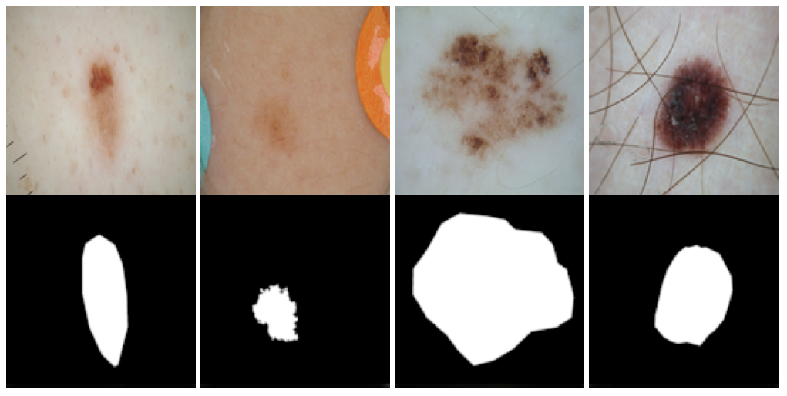

# Lesion skin cancer segmentation
### Based on the ISIC 2018 challenge which goal was to create automated predictions of lesion segmentation boundaries within dermoscopic images.

***
## Image Pre-Processing
### Challenges:
* vignette
* ink markings
* scale rulers
* skin lines
* blood vessels
* hair

### Common techniques
* adding 20-pixel border (U-net loss of border pixels)
* color space transformation
* contrast enchancement
* lesion localization
* artifact removal


### Pre-processing steps
1. Resize image to a constant computable dimension (e.g. 512x512)  
1. Add X-pixel border around the image as a buffer (e.g. 20 pixel)  
1. Convert image to grayscale to reduce image dimension and match format of orginal U-Net reference  
1. Contrast enchancement  
    This ensures images have consistent contrast between neighbouring areas and RoI. It will be accomplished by first calculating the histogram of grayscale image. The top 2% of histogram intensities were then selected and used as cut off values. Histogram then stretches to remap the darkest pixel to 0 and lightest to 255 against the selected cut off thresholds.  
1. Hair removal  
    Hairs are identified using an edge detection from PIL with a FIND_EDGES method with 1-pixel silhouette.  
    DullRazor?
    `[NEED MORE RESEARCH]`  
1. Remove the vignette frame  
    Pseudocode for removal algorithm  
    ```
    For up to 10 iterations  
        Create a circular mask with radius = half the height of the input image – 20 pixels + iteration*5 pixels  
        Calculate the mean of the outer circle
        If the mean pixel value of the outer ring < 6.0 then  
            Fill the outer ring with the mean pixel value of the center region 
            Return the corrected image
    ```  

***
## Image segmentation  
Segmentation will be performed using U-Net Convolutional Neural Network. 

### Loss functions to be examined
* Tversky 
* Dice coefficent 
* Jaccard  

### Parameters  
`[TBD]`  


***
## References  
1. Ronneberger O., Fischer P., Brox T. (2015) U-Net: Convolutional Networks for Biomedical Image Segmentation. In: Navab N., Hornegger J., Wells W., Frangi A. (eds) Medical Image Computing and Computer-Assisted Intervention – MICCAI 2015. MICCAI 2015. Lecture Notes in Computer Science, vol 9351. Springer, Cham. https://doi.org/10.1007/978-3-319-24574-4_28
  
1. Sara Ross-Howe, H.R. Tizhoosh - "The Effects of Image Pre- and Post-Processing, Wavelet Decomposition, and Local Binary Patterns on U-Nets for Skin Lesion Segmentation" - Kimia Lab, University of Waterloo, Waterloo, Ontario, Canada  

1. Tschandl, P. et al. The HAM10000 dataset, a large collection of multi-source
dermatoscopic images of common pigmented skin lesions. Sci. Data 5:180161 doi: 10.1038/sdata.2018.161 (2018).  

1. Nabila Abraham, Naimul Mefraz Khan - "A NOVEL FOCAL TVERSKY LOSS FUNCTION WITH IMPROVED ATTENTION U-NET FOR LESION SEGMENTATION" - Ryerson University Department of Electrical and Computer Engineering 350 Victoria Street, Toronto, ON  

1. https://challenge2018.isic-archive.com/participate/

